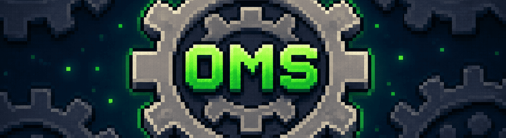

# Operate My Server

**Operate My Server (OMS)** is a modular server-side utility mod for Forge that provides automated restarts, server condition handling, and lifecycle control.
Lightweight, configurable, and designed to be extended through addons.

---

## What is OMS?
OMS is not just a restart mod.
It is a small platform where server behavior is built from independent features grouped into addons.  
Each feature can be enabled, disabled, configured, or extended without affecting the rest of the system.

---

## Core Capabilities

- Scheduled server restarts with player warnings  
- Condition-based triggers (low TPS, empty server, etc.)  
- Centralized restart and shutdown handling  
- Modular addon + feature architecture  
- Runtime config updates (when supported by feature)  

---

## Example Use Cases
- Run daily restarts with warnings for players  
- Restart the server when TPS drops for too long  
- Restart automatically when no players are online  
- Build your own automation logic using OMS API  

---

## Installation
Download:

1. Download **OMS**
   - [CurseForge](https://www.curseforge.com/minecraft/mc-mods/operate-my-server)
   - [Modrinth](https://modrinth.com/mod/operate-my-server)
2. Download **Kotlin For Forge**
   - [CurseForge](https://www.curseforge.com/minecraft/mc-mods/kotlin-for-forge)
   - [Modrinth](https://modrinth.com/mod/kotlin-for-forge)
3. Place both `.jar` files into your `mods/` folder  

Start the server normally - OMS will initialize automatically.

---

## Requirements
- Minecraft 1.20.1  
- Forge 47.4.0+  
- KotlinForForge 4.11.0  

Support for newer Minecraft and Forge versions is planned.

---

## Who Is It For
**Server owners**  
Automate restarts and react to server conditions

**Modpack developers**  
Bundle server-side automation into your pack

**Mod developers**  
Build lifecycle-driven features using OMS API

---

## Addons
OMS supports addons - separate mods that extend functionality.
Each addon can provide:
- features  
- commands  
- configuration  

Install addons like any other mod: drop the `.jar` into `mods/`.

---

## Documentation
Full documentation is available here:  
https://conboi.gitbook.io/oms-wiki  

Want to build your own addon?  
See the [Development Guide](https://conboi.gitbook.io/oms-wiki/developer-guide) on the same wiki.
